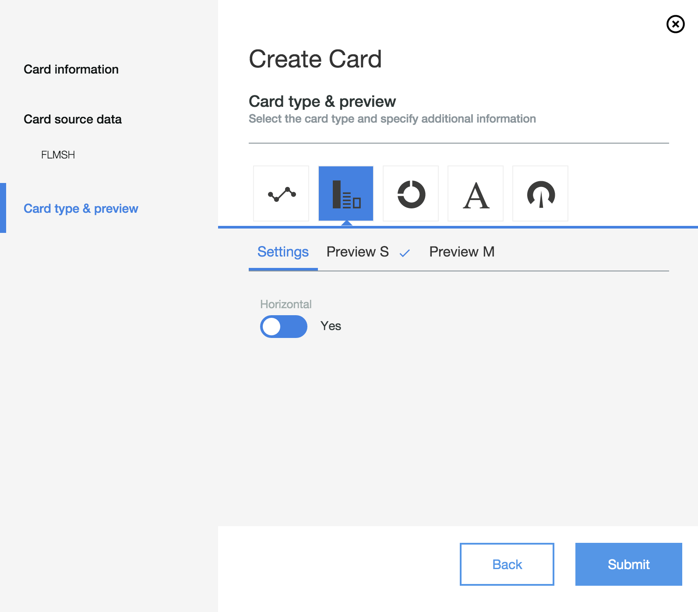

#Card customization

The dashboard has a generic customization dialog. Basic features are automatically covered, like

- change the card title
- add and change data points
- select a card type
- preview and select the initial size

Since some card types require additional information, the generic set of parameters can be extended using a plugin mechanism. The UI elements specified in the plugin appear in the *Settings* tab in the dialog. In this example, we have a switch to toggle between horizontal and vertical chart orientation.

The corresponding customization plugin is defined in the `customization` folder. A customization plugin has following tasks

- retrieve the parameters as props
- define a default value for the parameters in getDefaultProps
- assign the parameter value received as props to a state with the same name
- render a UI element to change the parameter reflected in the state object
- change the state object

      var BarChartProperties = React.createClass({
        propTypes: {
            horizontal: RPT.bool,
            nls: RPT.object,
            style: RPT.object,
            theme: RPT.object.isRequired
        },

        getDefaultProps: function() {
            return {
              horizontal: false
            };
        },

        getInitialState: function() {
            return {
                horizontal: this.props.horizontal,
            }
        },

        onHorizontalChanged: function(value) {
            this.setState({
              horizontal: value
            })
        },

        onUpdate: function(state) {
            var state = Object.assign({},this.state, state);
            this.setState(state);
        },

        render: function() {
            var self = this;
            var newProps = Object.assign({}, this.props, this.state);

            return (
                

                    <table style={styles.table}>
                        <tbody>
                            <tr>
                                <td>
                                    <Label label='Horizontal' theme={this.props.theme}>
                                        <SwitchBtn theme={this.props.theme} onChange={this.onHorizontalChanged} initialValue={!!this.state.horizontal} trueText="Yes" falseText="No" ></SwitchBtn>
                                    </Label>
                                </td>
                            </tr>
                        </tbody>
                    </table>
                

            );
        }
      })

The framework will feed in the existing parameter values into the props. After submitting the dialog, the changed value will be retrieved from the state object and written to the dashboard definition.

You have to link the customization plugin in the card definition in `DashboardConfig.json`. 
Note: Dynamic resource loading is currently not enabled. You have to manually require the customization plugin in DashboardStore.js.

    {
      "name": "BarChart",
      "displayName": "COMP_TITLE_StaticChart",
      "description": "COMP_DESC_StaticChart",
      "thumbnail" : "style/images/line-graph.svg",
      "category": "Devices",
      "module": "Devices",
      "wrapper": "ReactWrapper",
      "sizes": [[1,3],[2,3]],
      "parameters" : {
       "title":"",
        "component": "BarChart",
        "title": "Bar chart"
      },
      "customization": "BarChartProperties"
    }

