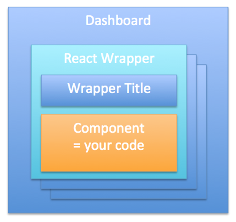

#Card interface#

The main interface for cards is the wrapper. The wrapper transforms and prepares the data flow. It also provides all necessary information to the card in a consumable way. The only wrapper implementation is currently `ReactWrapper.jsx` for React based cards.

The wrapper is the surrounding React component of each card. It communicates using props. There are default props for every card as well as card specific props.
Following standard props are available in your card

***wrapper*** Provides all information that should be relevant to layout the card content. Since we want to avoid using offsetHeight and offsetWidth to get the actual size of the card canvas, the wrapper object provides all necessary information for size calculations. Following information is available

- ***id*** The ID of the card
- ***width/height*** Width and height of the card measured in grid tiles. These values correspond to the size settings you find in the DashboardConfig or Dashboard configuration files. Use these values to toggle extra content in your card depending on the size.
- ***realHeight/realWidth*** Width and height of the canvas in pixel. Use these values for size calculations. You can also use 100% for width and height to use the full canvas.
- ***layout*** The formfactor or breakpoint. One of sm, md, and lg. You might use this information to adapt your rendering depending on the type of device your are using.

***style*** Style object that can be used by the card to use the full size of the canvas.

***theme*** Theme object that provides color mappings to enable branding for your cards. Use the color codes of the theme by using keywords instead of hardcoding color values.

***nls*** NLS object for translations

In addition to these default props, the card also receives all parameters from the card definition (in `DashboardConfig.json`) and your customized parameters defined in the custonization dialog. These parameters contain all information that is necessary for your card, like data points, card title and card name.
