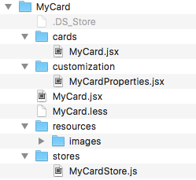
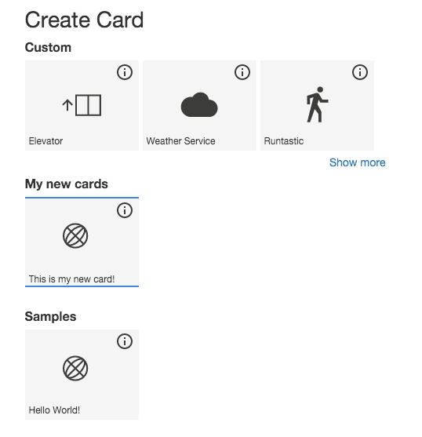

# Getting started - Your first card

Developing new cards for the dashboard is easy. Since there are several steps to do, before your cards shows up in the dashboard, it makes sense that you do not start from scratch. Use the existing HelloWorld sample card instead. It already contains most interesting aspects of a card which can just be reused and enhanced for your needs.

Follow these steps to create a new card based on the HelloWorld app:

- Custom cards are organized in modules. Locate the HelloWorld module in
`/commponents/HelloWorld`
- Copy the folder into the same directory and change the name to your new card name, e.g.
`/components/MyCard`
- Change all the file names in your module to something with `MyCard`instead of `HelloWorld`.

- Go to `MyCard/cards/MyCard.jsx`and change all occurrences of `HelloWorld`to `MyCard`. This is your React card component. 
- Go to `MyCard/customization/MyCardProperties.jsx`and change all occurrences of `HelloWorld`to`MyCard`. This is the customization plugin.
- Go to `MyCard/stores/MyCardStore.js`and change all occurrences of `HelloWorld`to `MyCard`. This is the DataStore to deliver new data to the card.
- Go to `MyCard/MyCard.jsc`and change all occurrences of `HelloWorld`to `MyCard`. This is the main module file. It references all other components of you module.
- Now have have prepared the code of your module. It can now be used as `MyCard`in the dashboard. Before you can do this, you must make it known to the dashboard.
- Go to `examples/public/config/DashboardConfig.json`. This is the configuration file for the sample application. It defines what cards are available in the dashboard. Find the entry for `HelloWorld` and duplicate it. Change all occurrences of `HelloWorld` to `MyCard` in the new entry. Also change the value of `category`in this entry. Specify a new category to easily find your new cards in the card gallery. Also specify a new title for the card so that you can see a difference to the `HelloWorld` card. Remember that we did not change any functionality so far. Do not forget any trailing commas whenn you make changes to the configuration.

    {
      "name": "MyCard",
      "displayName": "MyCard",
      "description": "Example card with simple customization and store",
      "thumbnail" : "overview",
      "category": "My new cards",
      "cardType": "NO_DATAPOINTS",
      "wrapper": "ReactWrapper",
      "sizes": [[2,3],[4,4]],
      "module": "MyCard",
      "parameters" : {
        "component": "MyCard",
        "title": "This is my new card!"
      },
      "customization": "MyCardProperties"
    },
    
- Now the dashboard knows about the `MyCard` module, but it still cannot find it since the code is not referenced. Go to `components/IoTFComponents.js`. Add a line `IoTFComponents.MyCard = require('./MyCard/MyCard.jsx');`.
- Now the main module file is referenced and therefore also all other components in the module.
- Open a console and follow the steps described in [Development environment](../ch4-env/develop.md)
- If you run `gulp` in your console you should see no errors. If you see errors, their should be pretty clear, indicating the line number where you have to change something. Fix it!
- Open your browser and open `http://localhost:6007/DashboardPlay.html`. Change 6007 to the port number of your node server. You should see the dashboard.
- Note that you have to wait till the build has finished (usually some seconds) before you can press refresh on your browser after you have changed something.
- In the dashboard, click "Add card". You should find your new card in the card gallery. Select it and add it to the dashboard.

- Now you can change your first new card step by step to adapt it to your needs.
- Congratulations! 

    

