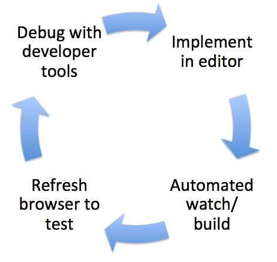

#Development environment

The dashboard development is optimized for fast and collaborative development.

###Repository
We use Github as code repository. You can find the code at following URL

[https://github.ibm.com/IoT/iotf-react](https://github.ibm.com/IoT/iotf-react)

This repository currently contains the common components, the dashboard framework and all cards. There are also some custom cards as well as sample cards. This might change in the future so that parts of the code can be developed in separate repositories.

You can fork the repository for your development project.

###Editor
Use your favorite editor. We use 2 spaces for indent.

###Browser
The dashboard supports all modern browsers. Although Chrome might be the best browser for development, you must test your code at least on IE and Firefox before intergration.

###Build and watch
It is necessary to build the code before you can test it in your browser. This is an automated process which takes only some seconds. Therefore, you can still use a trial-and-error approach when tweaking you code or css without losing time. 

Only some steps are necessary to start the automated watch/build

(in the root folder of the code base)

`   npm install`(install dependencies) 

`   gulp`(start watch for automated build) 

    cd examples

    npm install

`   npm run start`(start the test server) 

You can test your code in the browser at

http://localhost:PORT

You find the relevant port in the output of your test server console.

The watch job detects any changes in your code and performs following tasks

- rebuild the main component IoTFComponents.js
- create a minified version of IoTFComponents.js
- rebuild the style sheets and preprocess less
- copy the resources from all modules into the final resources directory

Read more about test environments in ...