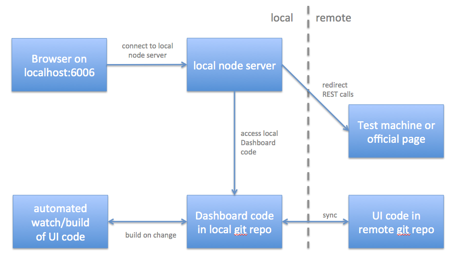
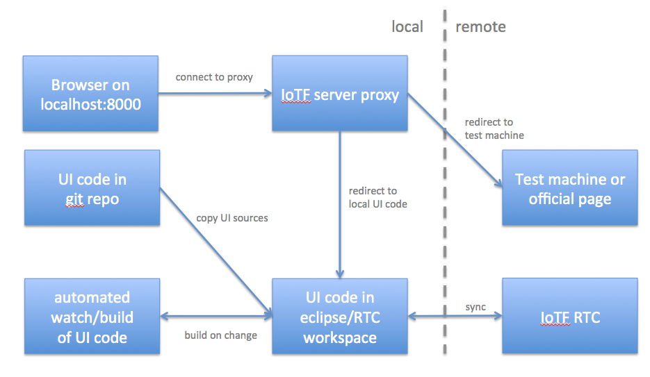

#Manual test approaches

There are multiple levels of manual test. The test approach you use depends on the stage of your development and the aspects you want to test.

###Stage 1a: Local stand-alone test
The dashboard development environment comes with a stand-alone application which contains only the dashboard. This is the fastest and easiest way to test your new code. You can

- test your latest changes in a trial-and-error approach
- tweak styling
- test your data flow and interaction with real device data or mocked IoTF data
- check the integration into the dashboard framework

You cannot test how your new code behaves in the IoTF user interface. You also do not have access to certain IoTF APIs. However, any back end data will most likely be mocked anyway in the first stage of your code development when you concentrate on the user interface. Therefore the local stand-alone test is normally the major part of your manual test.

To test your code locally:
- Integrate your new card in `/examples/public/config/DashboardConfig.json`. This configuration is used for testing cards. You can push your changes to git since this configuration will never be used for production.
- If you have already set up your development environment you can access your new card at http://localhost:PORT/DashboardPlay.html

The stand-alone application is an Angular based application and it uses the same interfaces to the dashboard framework.

###Stage 1b: Remote stand-alone test
When you want to invite others to test your code, especially for reviews with the design team, it is helpful to have the latest code remotely available. An automated deployment to a Bluemix URL is in place. You just have to commit your changes in the repository, wait for some minutes and your stand-alone test application will be available at

http://iotfcommondashboarddev.mybluemix.net/DashboardPlay.html

The remote test is also handy when you want to test on mobile devices or browsers on other machines (e.g. IE when you have a Mac).

You can also trigger the deployment process manually to avoid committing the code first. Use the `manifestDev.yml` file in the root directory for manual cf push to Bluemix.

###Stage 2: Locally integrated test using proxy
For certain IoTF APIs and full integrated test, it is necessary to test your new code in the real IoTF environment. Normally you would do a full deploy on a test machine but if you just want to test a changed UI, the proxy approach is much faster and easier.

The proxy connects to a test machine or the official page but it takes the UI part from your local machine. You can easily make changes and debug without losing much time on deploys. A local watch/build is in place which prepares your UI code and integrates it. You have full access to the APIs and can test almost all aspects of your UI. However, there are some edge cases which behave different in the locally integrated test.

To setup the locally integrated test, do the following:
- Setup an official IoTF development environment (see https://w3-connections.ibm.com/wikis/home?lang=en-us#!/wiki/Wbaca767aac15_4918_91ec_7d5014efde02/page/Developer%20Setup)
- Setup RTC and synchronize the code. Note: From our experience it proved to be very helpful to start with a new eclipse workspace if you run into strange problems.
- In your eclipse workspace (not your git repo!), open a shell in `iotcloud.ui.dashboard`
- `npm install`to load depenencies
- `set GRUNTENV=hou02-1`to set the test machine
- `grunt watch`to start a watch in your eclipse workspace (note: this is not the watch you use in your git repo). This watch is necessary to build the code in your RTC connected code base.
- In the git repo code base (this time NOT in the eclipse workspace), edit `/iotf-server-proxy/config.js` and add your credentials and test server information
- Connect to your test server with a browser. Use the developer tools to get the LTPA token from the cookies in your browser. The LTPA token starts with `LtpaToken2=`. Add this LTPA token in the cookie section of the config.js. Note that the token gets invalidated after some hours. 
- In `/iotf-server-proxy`run an `npm install` to load dependencies.
- Run `node app.js` to start the proxy server.
- Connect to your locally integrated test environment with `https://localhost:8000`. 

You can now access your UI code in your eclipse environment with a remote test server or the official IoTF page. Note that you have to copy the code from your git repo to the eclipse workspace. You find the modules for cards and components in `iotcloud.ui.common/react-modules/src`. Copying the code into this directory triggers the watch/build and generates the master module IoTfComponents.jsx and the style sheet.

###Stage 3: Deployment on test machine
For verification before final integration you should do a full deploy on a test machine with the latest RTC code level.